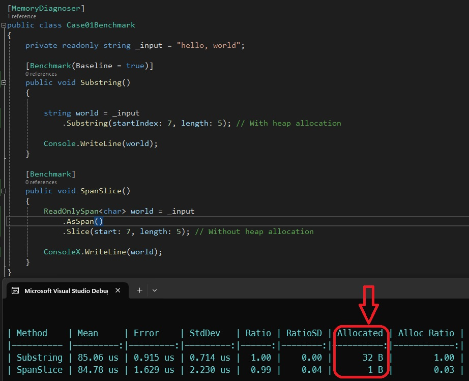
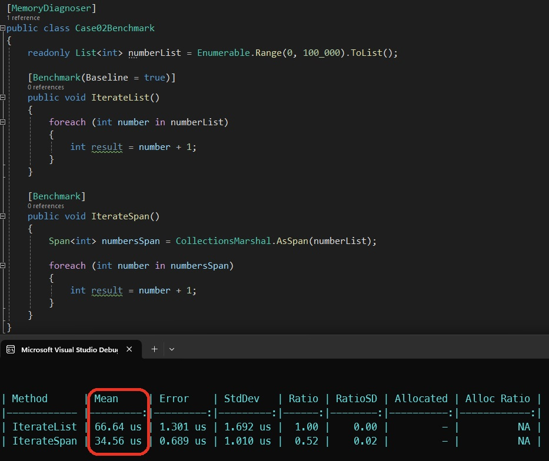
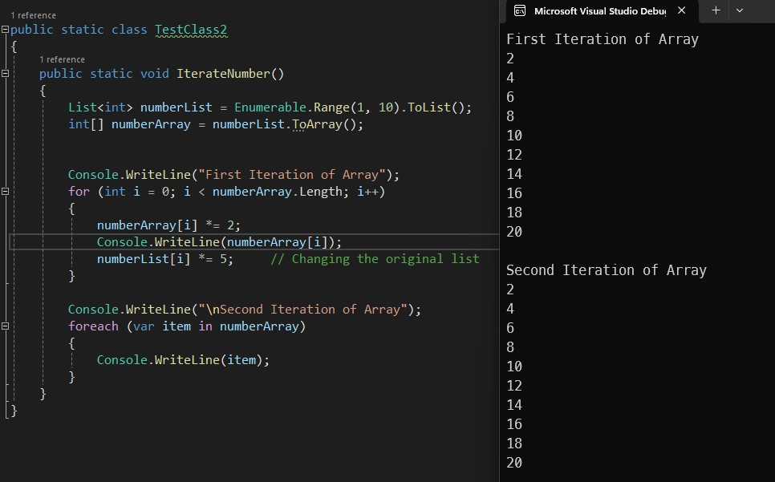
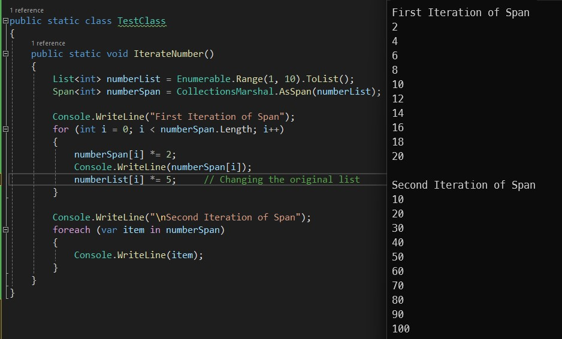
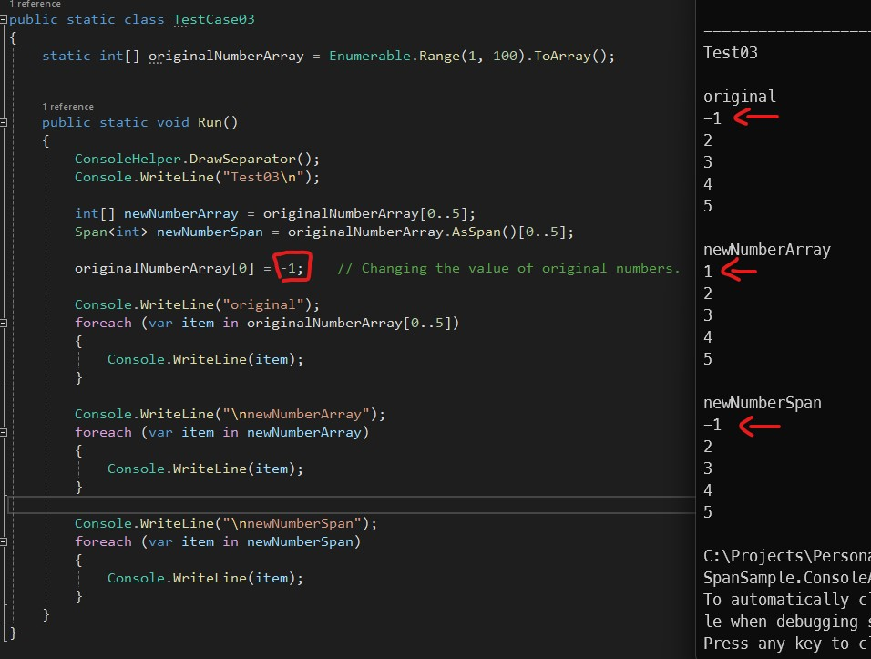
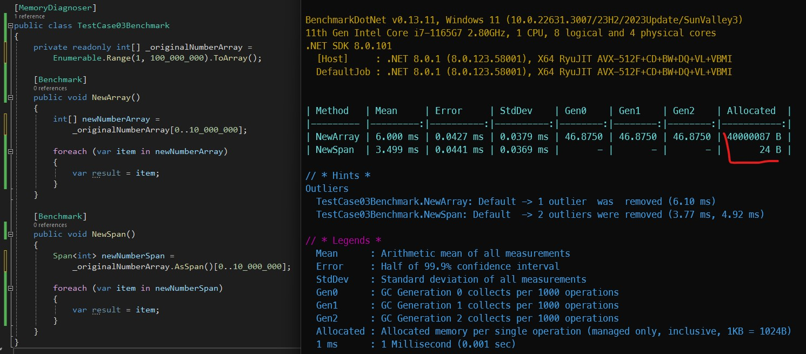
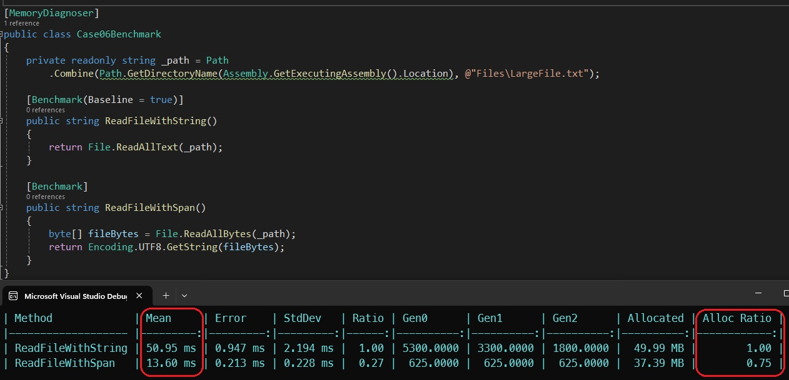

# `Span<T>`: Powerful Feature for Efficient Memory Management in C#

Span<`T`> is a value type containing a **ref** and a **length** (**ref struct**) that released as a part of C# 7.2 2017 and it brings enhanced memory management capabilities.

It enables the representation of contiguous regions of arbitrary memory, regardless of whether that memory is associated with a managed object, is provided by native code via interop, or is on the stack. And it does so while still providing safe access with performance characteristics like that of arrays.

## Some facts about Spans

Since span is a ref struct.<br>

> Spans always store in stack.

> We can't have a collection/array of spans.

> Spans can't be boxed.

> Spans can't be a field in a **class** or **struct**, however they can be a field in a **reft struct**, or, can be defined inside a methods.

> Spans can't be used as an **async** method argument or a lambda, however, they can be used as an **argument** or a **return type** for **synchronous** methods.<br>

---
## Span Usages
By using Spans we can prevent heap allocation and Improving performance of array operations such as copying, sorting, and searching.
### Preventing heap allocation (Case 01)
By using Spans we can prevent heap allocation.



---

### Iterating a List VS Iterating a Span (Case 02) 
Iterating a Span is much more faster than a list.<br>
For converting a list to a **Span** we can use *CollectionsMarshal.AsSpan()*



---

### Should not change the original list while we are iterating the span.
As we can see here if we create a new array<`int`> from a List<`int`>, changing the list does not affect the array anymore.



However, if we create a Span<`int`> we must not change the original list anymore, because **Span** is holding a reference to the underlying array structure inside the list.


---

## Case 03
When we split an array into another array, we are allocating more memory for the second array in the heap, however if we split it into a Span, we are only referring to the original array.<br>
We can use different methods to split span.
```C#
int[] originalNumberArray = Enumerable.Range(1, 100).ToArray();

Span<int> newNumberSpan = originalNumberArray.AsSpan()[0..5];
Span<int> newNumberSpan1 = originalNumberArray.AsSpan().Slice(0,5);
Span<int> newNumberSpan2 = originalNumberArray.AsSpan(0,5);
```



As we can see in the benchmark, we are not allocating more memory and we are just referring to the original array.



---
### Reading files (Case 06)
By using **Spans** for reading files we can have a faster and more memory efficient result.



---