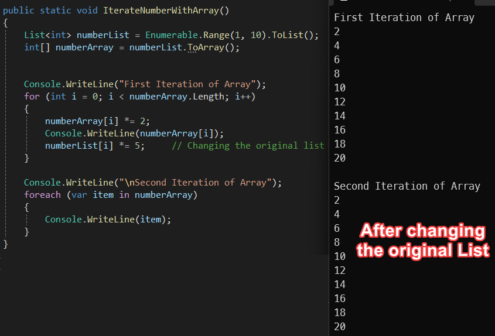
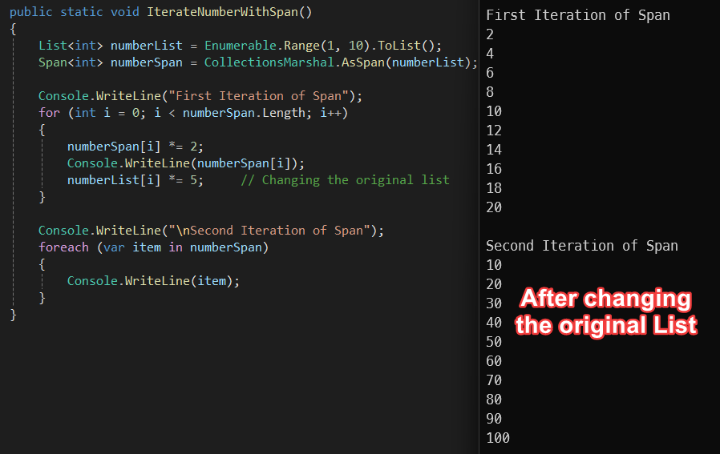
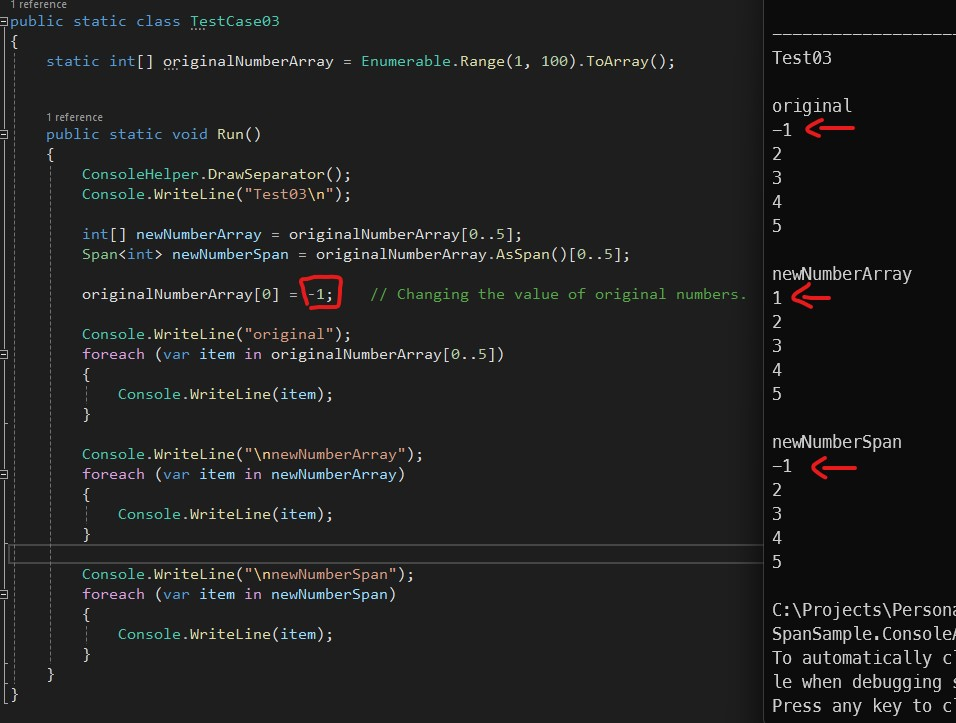
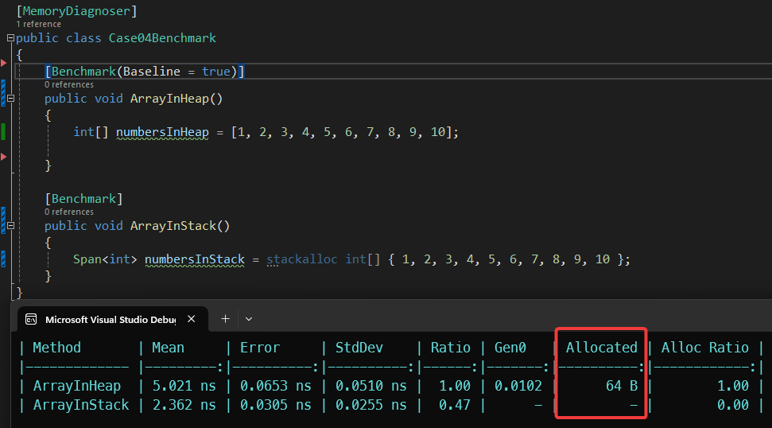
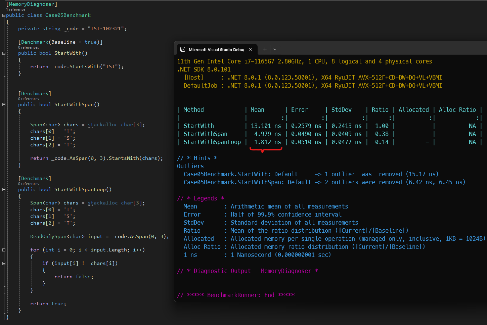

# `Span<T>`: Powerful Feature for Efficient Memory Management in C#

Span<`T`> is a value type containing a **ref** and a **length** (**ref struct**) that released as a part of C# 7.2 2017 and it brings enhanced memory management capabilities.

It enables the representation of contiguous regions of arbitrary memory, regardless of whether that memory is associated with a managed object, is provided by native code via interop, or is on the stack. And it does so while still providing safe access with performance characteristics like that of arrays.

## Some facts about Spans

Lets start we some facts about Span. <br>
Since span is a ref struct.<br>

> Spans always store in stack.

> We cannot have a collection/array of spans.

> Spans cannot be boxed.

> Spans cannot be a field in a **class** or **struct**, however, they can be a field in a **reft struct**, or, can be defined inside a methods.

> Spans cannot be used as an **async** method argument or a lambda, however, they can be used as an **argument** or a **return type** for **synchronous** methods.<br>

---
## Span Usages
By using Spans we can prevent heap allocation and improving performance of array operations such as **copying**, **sorting**, and **searching**.

### Preventing heap allocation (Case 01)
By using Spans we can prevent heap allocation.


---

### Iterating a List VS Iterating a Span (Case 02) 
Iterating a Span is much more faster than iterating a list.<br>
For converting a **List** to a **Span** we can use *CollectionsMarshal.AsSpan()*


> The original list must not change while the the span is being iterated.

As we can see here if we create a new array<`int`> from a List<`int`>, changing the original list does not affect the array.



However, if we create a Span<`int`> we must not change the original list as we said, because **Span** is holding a reference to the underlying array structure inside the list.


---

## Slicing a Span (Case 03)
When we split an array into another array, we are allocating more memory for the second array in the heap, however if we split it into a **Span**, we are only referring to the original array.<br>
We can use different methods to split span.
```C#
int[] originalNumberArray = Enumerable.Range(1, 100).ToArray();

Span<int> newNumberSpan = originalNumberArray.AsSpan()[0..5]; // Using Range
Span<int> newNumberSpan1 = originalNumberArray.AsSpan().Slice(0,5); // Using Slice method
Span<int> newNumberSpan2 = originalNumberArray.AsSpan(0,5); // Using the constructor
```



As we can see in the benchmark, we are not allocating more memory and we are just referring to the original array.


---

## Eliminating the need to using unsafe code in some cases. (Case 04)
As we know arrays are reference types, so the values are stored in the heap and the reference stores in the stack.<br>
Therefore, if we want to declare an array in stack we should use **unsafe** code and allocate it directly into stack.<br> 
But by using Spans we can avoid using unsafe code and create an array directly in the stack.
```C#
static void UsingUnsafe()
{
    const int length = 5;
    unsafe
    {
        int* numbersInStackPointer = stackalloc int[length] { 1, 2, 3, 4, 5 };

        for (int i = 0; i < length; i++)
        {
            Console.WriteLine(numbersInStackPointer[i]);
        }
    }
}

static void UsingSpan()
{
    // Declaring the array in the stack
    Span<int> numbersInStack = stackalloc int[] { 1, 2, 3, 4, 5 };

    foreach (var number in numbersInStack)
    {
        Console.WriteLine(number);
    }
}
```
We can also see the benchmark here for the memory allocation.



---

## Comparing a string. (Case 05)
We can also use Span when we need to compare strings or looking for some characters inside them.<br>



---

## Conclusion
In conclusion, the Span<`T`> is a useful way for handling and manipulating data in memory.<br>
It provides a unified, type-safe, and efficient representation of contiguous regions of arbitrary memory. Its usage can lead to significant performance improvements by reducing unnecessary memory allocations and copying. However, it’s important to use Span<`T`> wisely, understanding its limitations and the potential for misuse. As with any powerful tool, it comes with its own set of challenges and complexities.