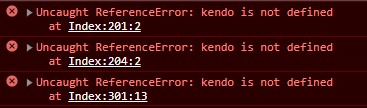
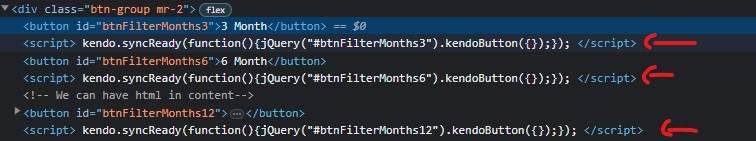

# Telerik UI for MVC (Kendo UI)
Telerik UI for ASP.NET MVC provides a collection of pre-built UI components that can be easily integrated into ASP.NET MVC applications, allowing developers to create responsive and feature-rich web interfaces. These components cover a wide range of functionality, including data grids, charts, input controls, navigation menus, and more.

---

## Installation
1. Open your account profile in Telerik.com
2. Go to the **Downloads** section and click on **Progress® Telerik® UI for ASP.NET MVC**.
3. From the Other Setup Files section, download the Telerik.UI.for.AspNet.Mvc5....nupkg nuget package.
4. In Visual Studio, right click on your project and go to Manage Nuget Packages.
5. Click on the **Cogwheel** icon and then click on the **plus** icon to add new source.
6. For the source, select the folder that contains your .nupkg downloaded package, name it TelerikUI and click Update, then click ok.
7. In the NuGet Package Manger, change the **Package source** to **TelerikUI** and install **Telerik.UI.for.AspNet.Mvc5** package.
8. Add the kendo StyleSheets in the head tag. (We can choose different themes).
    ```html
        <link href="~/Content/kendo/2023.2.718/default-main.css" rel="stylesheet" />
    ```
9. Add the kendo scripts to layout, otherwise we will the **kendo is not defined** error.<br>
These scripts must be added after the **Jquery** script and before widgets scripts.<br>
It's also recommended that we add these scripts in the head tag.<br>

    ```html
            @Scripts.Render("~/bundles/jquery")
            <script src="~/Scripts/kendo/2023.2.718/kendo.all.min.js"></script>
            <script src="~/Scripts/kendo/2023.2.718/kendo.timezones.min.js"></script>
            <script src="~/Scripts/kendo/2023.2.718/kendo.aspnetmvc.min.js"></script>
            @Html.Kendo().DeferredScripts() <!-- Deferred scripts will be rendered here-->
        </head>
    ```

---

## Using Widgets
For using a Kendo UIs we must use Html helper in the view.<br>
> note: Adding the name is mandatory. and name would be the **Id** of the element.
```html
@Html.Kendo().Button().Name("btnTest")
@Html.Kendo().Button().Name("btnSecond").Content("Second Button")

<!-- We can have html in content-->
@Html.Kendo().Button().Name("btnThird").Content("<span>Second Button</span>")
```
> note: We must use @(Html) format to be able to break the lines <br>
```html
@(Html.Kendo().Button()
    .Name("btnTest")
    .Content("Test")
    .Icon("calendar")
    .Deferred())
```

By default every widget, creates a script below the element. 


### Deferred()
With deferred we can prevent the script creation and set a location for all scripts.<br>
If we are using Deferred, we should also specify where do we want to those scripts to be rendered.

```html
@Html.Kendo().Button().Name("btnTest").Content("Test").Deferred()

<!-- Deferred scripts will be rendered here-->
<!-- We have defined a section named scripts in our _layout page -->
@section scripts{
    @Html.Kendo().DeferredScripts()
}
```

### Icon()
We can Add icon with Icon method.

```html
@Html.Kendo().Button().Name("btnTest").Content("Test").Icon("calendar")
```

### HtmlAttributes()
We can Add attributes to the element by this method.

```html
@(Html.Kendo().Button()
    .Name("Test")
    .HtmlAttributes(new {@class = "k-button-solid-primary" })
    .Deferred())

<!-- We can also use conditions-->
@(Html.Kendo().Button()
    .Name("Test")
    onclick = "location.href = '" + Html.Raw(Url.Action("Index","Dashboard", new {months = 6})) + "';"
    .Deferred())

<!-- Another sample -->
@(Html.Kendo().Button()
    .Name("btn-test")
    .Content("Test")
    .HtmlAttributes(new 
    {
        onclick = "location.href = '" + Html.Raw(Url.Action("Index","Dashboard", new {months = 6}))
    })
    .Deferred())

```

### Events()
We can assign events to the elements by this function.<br>
in the events.click() we must write the name of a javascript function or a function inline.

```html
@(Html.Kendo().Button()
    .Name("btnHi")
    .Content("Say Hi")
    .Events(events =>
    {
        events.Click("sayHi");
    })
    .Deferred())

<!--Or with inline function -->
@(Html.Kendo().Button()
    .Name("btnBye")
    .Content("Say Bye")
    .Events(events =>
    {
        events.Click("function() { sayBye('Saman'); }");
    })
    .Deferred())
    
<script>
    function sayHi() {
        alert('Hi');
    }
    function sayBye(name) {
        alert(`Bye${name}`);
    }
</script>
```

### Template()
We can define a custom template for an element.
For rendering values in HTMl we are must using this syntax: #= ... # <br>
Syntax for using HTML encoding to display values: #: ... # <br>
Syntax for executing arbitrary javascript code:: # if(true) {# non-script content here #} # <br>

```html
@(Html.Kendo()
    .DropDownListFor(model => model.SelectedStatus)
    .BindTo(Model.Statuses)
    .Value(Model.SelectedStatus.ToString())
    .Template("<span>Hello</span>")
    .Deferred()
)

<!-- Model.Statuses is a IEnumerable<SelectListItem> so we can have access to the Text value -->
@(Html.Kendo()
    .DropDownListFor(model => model.SelectedStatus)
    .BindTo(Model.Statuses)
    .Value(Model.SelectedStatus.ToString())
    .Template("<span>#:data.Text#</span>")
    .Deferred()
)
```


---

## UI Components
Some samples of different UI components

### Text Boxes

```html
@Html.Kendo().TextBox().Name("Title")

<!-- Text box for model-->
@Html.Kendo().TextBoxFor(model => model.Title)
```

### DropDown List
```html
@(
    Html.Kendo()
    .DropDownListFor(model => model.Course)
    .BindTo(Model.Courses)
    .Value(Model.Course.ToString())
)
```
The model:
```C#
public class Product
{
    private readonly List<CourseEnum> _courses = new List<CourseEnum> 
        { CourseEnum.CSharp, CourseEnum.Python, CourseEnum.SQL};

    [Required, Display(Name = "Title")]
    public string Title { get; set; }

    [Display(Name = "Course")]
    public CourseEnum Course { get; set; }

    public IEnumerable<SelectListItem> Courses 
    {
        get { return new SelectList(_courses, CourseEnum.CSharp); }
    }
}
```


### ComboBox
With ComboBox we load load more complex objects

```HTML
@(Html.Kendo()
    .ComboBoxFor(model => model.SelectedCourseId)
    .BindTo(Model.Courses)
    .DataValueField("Id")
    .DataTextField("Title")
    .Placeholder("Select a course")
)

```


### TabStrip()
We can create tab view wth **TabStrip()**, we must use the **Items()** to define our tabs and for static content we can use **Content()** or **LoadContentFrom("Action, Controller, parameters")** form loading data.<br>
For **LoadContentFrom()** we can use return **PartialView** in the Action.
```html
@(Html.Kendo()
    .TabStrip()
    .Name("tabStrip")
    .Items(tab =>
    {
        tab.Add().Text("Details").Content("<p>Some texts for details tab</p>").Selected(true);
        tab.Add().Text("Description").Content("<p>Some texts for description tab</p>");
    })
)

<!-- Loading Dynamically -->
@(Html.Kendo()
    .TabStrip()
    .Name("tabStrip")
    .Items(tab =>
    {
        tab.Add().Text("Details")
            .LoadContentFrom("StudentDetails", "Student", Model.Id);
        tab.Add().Text("Courses")
            .LoadContentFrom("StudentCourses", "Student", Model.Id);
    })
)
```


