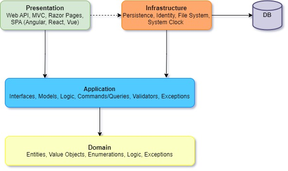

# Clean Architecture
There are 4 layers in Domain-Driven Design



## Setup the folders structure
1. Create four folders for each layer (**Presentation**, **Infrastructure**, **Application**, **Domain**).
2. Create a **API** project named CleanArchitecture.**Api** in **Presentation** folder.
3. Create a **class library** project named CleanArchitecture.**Contracts** in **Presentation** folder.
4. Create a **class library** project named CleanArchitecture.**Application** in **Application** folder.
5. Create a **class library** project named CleanArchitecture.**Infrastructure** in **Infrastructure** folder.
6. Create a **class library** project named CleanArchitecture.**Domain** in **Domain** folder.

## Projects Dependencies 

1. In the **Api** project add a refrence to **conctracts** and **application** projects.
2. In the **Infrastructure** project add a refrence to the **application** project.
3. In the **Application** project add a refrence to the **domain** project.
4. In the **Api** project add a refrence to the **Infrastructure** project. (theoretically, the Presentation shouldn't have a reference to the Infrastructure layer, but in actuality, we need a reference to infrastructure).

> Domain_Should_NotHaveDependencyOnApplication
> DomainLayer_ShouldNotHaveDependencyOn_InfrastructureLayer
> DomainLayer_ShouldNotHaveDependencyOn_PresentationLayer
> ApplicationLayer_ShouldNotHaveDependencyOn_InfrastructureLayer
> ApplicationLayer_ShouldNotHaveDependencyOn_PresentationLayer
> InfrastructureLayer_ShouldNotHaveDependencyOn_PresentationLayer
---

## Defining Entities in **Domain Layer**
We Define entities and exceptions in the domain layer.
1. Open the **CleanArchitecture.Domain**, create a folder named Entities, and inside that create a class named **User**
```C#
namespace CleanArchitecture.Domain.Entities;

public class User
{
    public Guid Id { get; set; } = Guid.NewGuid();
    public string FirstName { get; set; } = string.Empty;
    public string LastName { get; set; } = string.Empty;
    public string Email { get; set; } = string.Empty;
    public string Password { get; set; } = string.Empty;
}
```
---
## Defining IDateTimeProvider interface in **Application layer**
1. Open the **CleanArchitecture.Application** project.
2. Navigate to **Common/Interfaces/Services/** and create IDateTimeProvider **interface**.
```C#
namespace CleanArchitecture.Application.Common.Interfaces.Services;

public interface IDateTimeProvider
{
    DateTime UtcNow { get; }
}
```

## Implementing IDateProvider in **Infrastructure layer**
1. Open the **CleanArchitecture.Infrastructure** project.
2. Navigate to **Services/** then create **DateTimeProvider** class and Implement **IDateTimeProvider**
```C#
namespace CleanArchitecture.Infrastructure.Services;
using CleanArchitecture.Application.Common.Interfaces.Services;

public class DateTimeProvider : IDateTimeProvider
{
    public DateTime UtcNow => DateTime.UtcNow;
}
```
## Registering DateTimeProvider service.
1. Install Microsoft.Extensions.DependencyInjection.Abstractions package in **CleanArchitecture.Infrastructure** project.
2. In **CleanArchitecture.Infrastructure** project creates a class named DependencyInjection.
3. Create AddInfraStructure method and Add DateTimeProvider as a singleton service.

note: **AddInfraStructure** method returns all services for the Infrastructure layer.

```C#
using CleanArchitecture.Application.Common.Interfaces.Services;
using CleanArchitecture.Infrastructure.Services;
using Microsoft.Extensions.DependencyInjection;

namespace CleanArchitecture.Infrastructure;

public static class DependencyInjection
{
    public static IServiceCollection AddInfraStructure(this IServiceCollection services)
    {
        services.AddSingleton<IDateTimeProvider, DateTimeProvider>();
        return services;
    }
}
```
4. Open **CleanArchitecture.Api** Project and in **program.cs** register the infrastructure DependencyInjection
```C#
builder.Services
    .AddInfraStructure();  // Registering Infrastructure Dependencies
```
---

## Presentation Layer - Contracts

1. Open the **CleanArchitecture.Contracts** project and create a folder named Authentication then create the following **records** for requests model.
```c#
namespace CleanArchitecture.Contracts.Authentication;

public record RegisterRequest(
    string FirstName,
    string LastName,
    string Email,
    string Password);
```
```c#
namespace CleanArchitecture.Contracts.Authentication;

public record LoginRequest(
    string Email,
    string Password);
```

## Presentation Layer - API
1. Open the **CleanArchitecture.Api** project and create a **Api Controller** named **AuthenticationController**
```C#
namespace CleanArchitecture.Api.Controllers;

using CleanArchitecture.Contracts.Authentication;
using Microsoft.AspNetCore.Mvc;

[Route("[controller]")]
[ApiController]
public class AuthenticationController : ControllerBase
{
    [HttpPost]
    [Route("Login")]
    public async Task<IActionResult> Login([FromBody]LoginRequest request)
    {
        return NoContent();
    }

    [HttpPost]
    [Route("Register")]
    public async Task<IActionResult> Register([FromBody] RegisterRequest request)
    {
        return NoContent();
    }
}
```


## Application layer
We Defining our Interfaces here.
1. Install **Microsoft.Extensions.DependencyInjection.Abstractions** package in **CleanArchitecture.Application** project.
2. Create a folder named **Services** then inside Services create a folder named **Authentication**.
3. In **Authentication** folder create a record named **AuthenticationResult**
```C#
using CleanArchitecture.Domain.Entities;

namespace CleanArchitecture.Application.Services.Authentication;

public record AuthenticationResult(
    User User,
    string Token);

```

3. In **Services/Authentication** folder create an **interface** named **IAuthticationService**.
```C#
namespace CleanArchitecture.Application.Services.Authentication;

public interface IAuthenticationService
{
    AuthenticationResult Login(string email, string password);
    AuthenticationResult Register(string firstName, string lastName, string email, string password);
}
```

4. In **Services/Authentication** folder create a class named **AuthticationService** and implement the **IAuthticationService** interface.
```C#
public class AuthenticationService : IAuthenticationService
{
    private readonly IJwtTokenGenerator _jwtTokenGenerator;
    private readonly IUserRepository _userRepository;

    public AuthenticationService(IJwtTokenGenerator jwtTokenGenerator, IUserRepository userRepository)
    {
        _jwtTokenGenerator = jwtTokenGenerator;
        _userRepository = userRepository;
    }

    public AuthenticationResult Login(string email, string password)
    {
        if (_userRepository.GetByEmail(email) is not User user)
        {
            throw new Exception("This email does not exist");
        }

        if (user.Password != password)
        {
            throw new Exception("Wrong password");
        }

        var token = _jwtTokenGenerator.GenerateToken(user);

        return new AuthenticationResult(user, token);
    }

    public AuthenticationResult Register(string firstName, string lastName, string email, string password)
    {
        if (_userRepository.GetByEmail(email) is not null)
        {
            throw new DuplicateEmailException();
        }

        var user = new User
        {
            FirstName = firstName,
            LastName = lastName,
            Email = email,
            Password = password
        };

        _userRepository.Add(user);


        var token = _jwtTokenGenerator.GenerateToken(user);

        return new AuthenticationResult(user, token);
    }
}
```

2. Create services here
3. Define the DependencyInjection

## Infrastucture layer
We Implement the Interfaces here
1. Install Microsoft.Extensions.DependencyInjection.Abstractions package
2. Define the DependencyInjection
```C#
namespace CleanArchitecture.Infrastructure;
using Microsoft.Extensions.DependencyInjection;

public static class DependencyInjection
{
    public static IServiceCollection AddInfraStructure(this IServiceCollection services)
    {
        return services;
    }
}
```
3. Install System.IdentityModel.Tokens.Jwt package
4. Install Microsoft.Extensions.Configuration package  
5. Install Microsoft.Extensions.Options.ConfigurationExtensions package

### Adding user secret
1. For initialing the user secrets run this command in terminal
    - dotnet user-secrets init --project \<projectFolderPath>
2. For setting the value of the user secret run this command in terminal
    - dotnet user-secret set --project \<projectFolderPath> \<"settingKeyNameInAppSetting"> \<"user-secret-value">

Example
```powershell
dotnet user-secrets init --project .\Presentation\CleanArchitecture.Api\
dotnet user-secrets set --project .\Presentation\CleanArchitecture.Api\ "JwtSettings:Secret" "super-secret-key-from-user-secrets"
```
