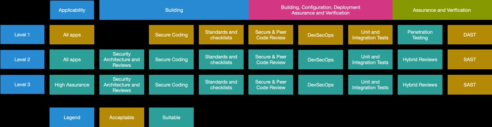
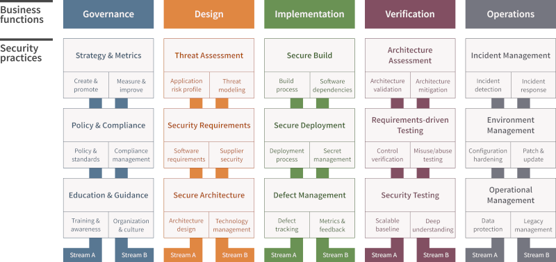

# Open Web Application Security Project (OWASP)
 OWASP is a nonprofit foundation that works to improve the security of software. 
 It is well-known in the information security community for its extensive resources, tools, and **best practices** aimed at enhancing the security of **web applications**.
 

## Common Weakness Enumeration (CWE)
CWE is a list of software and hardware **weakness types**. It is maintained by the MITRE Corporation with the aim of serving as a common language for describing software security vulnerabilities, a standard measuring stick for software security tools, and a baseline for weaknesses identification, mitigation, and prevention efforts.

## Common Vulnerabilities and Exposures (CVE)
CVE is a list of **publicly disclosed** cybersecurity vulnerabilities and exposures. It is maintained by the MITRE Corporation and is widely used by the security community to identify and catalog vulnerabilities in software and hardware.

> CVEs are linked to CWEs and CWEs are linked to OWASP top 10 risk.

## OWASP TOP 10 (2021)
### Broken Access Control

#### CWE - 942 CORS
#### CWE-352 CSRF

## TOP 10 Proactive Controls
The OWASP Top 10 Proactive Controls is a list of security measures that software developers should incorporate into their development processes to improve the security of applications. These controls represent a comprehensive set of best practices for mitigating common security risks. 
You can find the details in https://owasp.org/www-project-proactive-controls

### C1 - Define Security Requirements
- Establish security requirements early in the development lifecycle.
- Incorporate industry standards and regulatory requirements.
- Include security considerations for authentication, access control, data protection, and more.
### C2 - Leverage Security Frameworks and Libraries
- Use well-vetted security libraries and frameworks to avoid reinventing the wheel.
- Ensure that these frameworks are regularly updated and patched.
- Understand how to properly integrate these tools into your applications.
### C3 - Secure Database Access
- Use secure methods for database connections, such as parameterized queries or prepared statements.
- Avoid direct queries with user input to prevent SQL Injection.
- Implement proper database permissions and roles.
### C4 - Encode and Escape Data
- Ensure that all data is properly encoded or escaped to prevent injection attacks.
- Use appropriate encoding methods based on the context (e.g., HTML, XML, URL).
- Validate input to ensure it conforms to expected formats.
### C5 - Validate All Inputs
- Perform input validation on all data from untrusted sources.
- Use whitelisting (allowing only known good data) as opposed to blacklisting.
- Implement server-side validation in addition to client-side validation.
### C6 - Implement Digital Identity
- Establish strong authentication mechanisms, such as multi-factor authentication (MFA).
- Securely manage user credentials and sessions.
- Implement proper password policies and storage techniques (e.g., hashing with salts).
### C7 - Enforce Access Controls
- Apply the principle of least privilege by limiting user access to only what is necessary.
- Use role-based access control (RBAC) or attribute-based access control (ABAC).
- Regularly review and update access controls as necessary.
### C8 - Protect Data Everywhere
- Encrypt sensitive data both at rest and in transit using strong encryption methods.
- Ensure proper key management practices are in place.
- Implement data masking and tokenization where appropriate.
### C9 - Implement Security Logging and Monitoring
- Log security-relevant events (e.g., login attempts, data access).
- Ensure logs are protected from tampering and are retained for a suitable period.
- Set up monitoring and alerting to detect and respond to potential security incidents.
### C10 - Handle All Errors and Exceptions
- Implement proper error handling to ensure that sensitive information is not exposed.
- Return generic error messages to users while logging detailed errors internally.
- Regularly review and test error handling mechanisms to ensure they work as intended.
---

## Application Security Verification Standard (ASVS)
ASVS is a framework developed by the OWASP for specifying and verifying the security requirements of web applications. It **provides** a comprehensive set of **security requirements** and **guidelines** to help organizations **design**, **develop**, and **test** secure applications. 
ASVS consist of **14 chapters**, each with **3 levels** of verifications. 

You can find more details on https://owasp.org/www-project-application-security-verification-standard  
and the github project https://github.com/OWASP/ASVS/tree/v4.0.3#latest-stable-version---403

## OWASP Cheat Sheets
The OWASP Cheat Sheets are concise, easy-to-reference **guides** to help developers and security professionals **implement best practices** for application security. These cheat sheets cover a wide range of topics and provide practical advice and specific recommendations to address common security challenges in software development. 
The OWASP Cheat Sheets are available on the OWASP Cheat Sheet Series website. https://owasp.org/www-project-cheat-sheets/ and https://cheatsheetseries.owasp.org/ and https://github.com/OWASP/CheatSheetSeries

## OWASP SAMM (Software Assurance Maturity Model)
OWASP SAMM is a comprehensive framework developed by the Open Web Application Security Project (OWASP) to help organizations formulate and implement a strategy for software security that is tailored to their specific risks. SAMM provides a structured approach to improving and measuring the security maturity of software development practices. 
The SAMM is organized around **15 security practices** that they're group into **5 business functions** (Governance, Design, Implementation, Verification, Operations). Each of the 15 practices has **2 streams** and each steam defines **3 maturity levels** that increase in sophistication. 

 
We can also use **SAMM Toolbox** which provides practical support for assessing, planning, and improving software security practices according to the SAMM framework. 
You can find the models in https://owasp.org/www-project-samm/

## OWASP WSTG (Web Security Testing Guide)
Is a comprehensive **manual** developed by the Open Web Application Security Project (OWASP) that provides a framework and methodology for testing the security of web applications. It is designed to help security professionals, developers, and testers identify and mitigate security vulnerabilities in web applications. 
The OWASP Web Security Testing Guide is available for free on the OWASP website https://owasp.org/www-project-web-security-testing-guide/
## OWASP Top 10 Ordering
- Incident Rate
- Exploitability
- Impact

