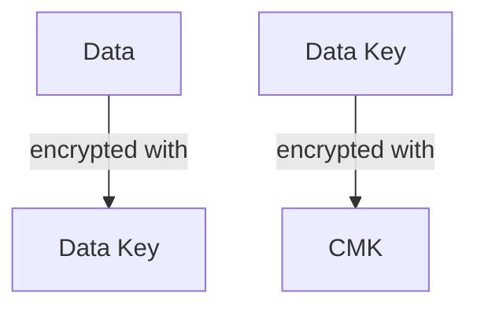
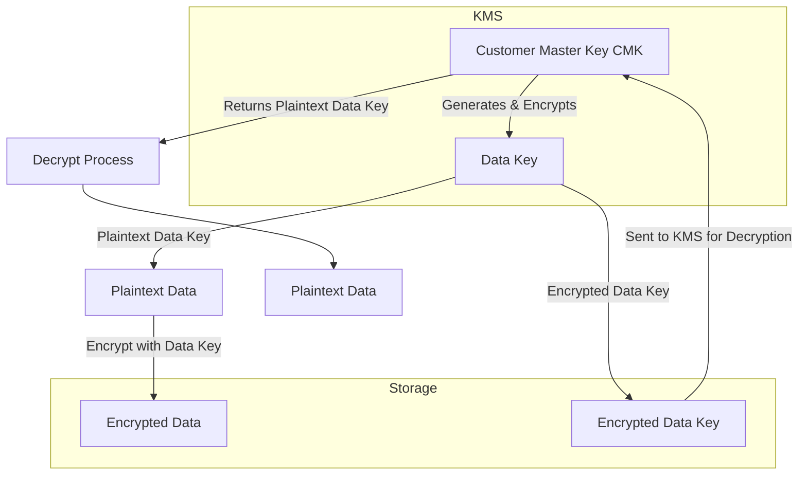

# AWS Key Management Service (KMS) and Encryption Guide

This document provides a simple explanation of AWS KMS, Customer Master Keys (CMKs), and Envelope Encryption, with a focus on usage in **.NET applications**.

---

## 🔐 What is Data Encryption in AWS?
Data encryption in AWS is about protecting your data by converting it into a form that is unreadable to anyone who doesn’t have the right decryption key.<br>
AWS offers both encryption **at rest** (data stored on disks) and encryption **in transit** (data moving between services, networks, or applications).

The main service that AWS provides for encryption management is AWS **Key Management Service (KMS)**.

---

## 🔑 What is AWS KMS?

**AWS Key Management Service (KMS)** is a managed service that allows you to create, store, and control **encryption keys** used to protect your data.  
It removes the need to manually manage cryptographic keys and integrates with many AWS services.

### Key features:

- Centralized management of keys.
- Integration with AWS services (S3, RDS, Lambda, etc.)
- Automatic key rotation (optional).
- Auditing through AWS CloudTrail.
- Supports **envelope encryption**.
- KMS only manages **Customer Master Keys (CMKs)** — it does **not** store or manage **data keys**.
- KMS uses **Hardware Security Modules (HSMs)** to store CMKs.


---

## 🔐 Customer Master Key (CMK)

A **Customer Master Key (CMK)** is the main resource in KMS.  
The root of AWS encryption is the **CMK** managed by AWS KMS.

It is used to:

- Encrypt and decrypt **data keys**
- Control access with IAM policies and key policies.
- Optionally enable automatic rotation.

### Key details:
- A **CMK never leaves the region** it's created in.
- A **CMK can encrypt up to 4 KB** of data directly. For larger data, you should use **data keys**.
- CMKs are best used for generating and protecting data keys, not for encrypting large data payloads.
- A CMK is used for generating a data encryption key (DEK).
- multiple Data Keys can be generated  out of a CMK.

### Types of CMKs:

1. **AWS-managed CMK**  
   Automatically created and managed by AWS.
2. **Customer-managed CMK**  
   Created and managed by you. Provides full control.

> ⚡ CMKs should not be used directly for encrypting large data. Instead, use them to generate and protect **data keys**.

---

## Data Keys (DEK)
Since CMKs can’t encrypt large data, AWS uses a process called **Envelope Encryption**.<br>
The CMK creates a data key, which is used to encrypt the actual data.

### Process: 
1. AWS KMS generates a data key (both plaintext and encrypted versions).
2. Your application uses the plaintext data key to encrypt data locally.
3. You discard the plaintext data key after use.
4. You store the encrypted data key alongside your encrypted data.
5. To decrypt, you send the encrypted data key to KMS, which returns the plaintext key for decryption.

👉 Data keys are like temporary keys to lock/unlock your data.

---

## 📦 Envelope Encryption

Envelope Encryption is a common practice for securing data efficiently.


Envelope encryption is a method where a data encryption key (DEK) encrypts sensitive data, and a key encryption key (KEK) encrypts the DEK. The encrypted DEK is stored alongside the encrypted data, forming an "envelope." The KEK is securely managed, often in a key management system (KMS), ensuring the DEK can only be decrypted by authorized entities. This approach enhances security by separating the encryption of data from the management of the keys, allowing efficient key rotation and access control without re-encrypting the data. It's widely used in cloud environments, like AWS KMS, for scalable and secure data protection.

### How It Works

1. Generate a Data Key using KMS (a symmetric key).

2. Use the Data Key to locally encrypt your data (fast and efficient).

3. Encrypt the Data Key itself using the CMK in KMS.

4. Store the encrypted data and the encrypted data key together.

## When decrypting:

- Retrieve the encrypted data key.

- Ask KMS to decrypt the data key with the CMK.

- Use the decrypted data key to decrypt the data.

### Envelope Encryption Flow



### This method:

Minimizes calls to KMS (improving performance).

Allows secure local encryption/decryption.

Keeps CMKs safe by never exposing them.




--- 
## 🛠️ Using KMS in .NET

You can use the **AWS SDK for .NET** to work with KMS.

### Install the NuGet Package

```bash
dotnet add package AWSSDK.KeyManagementService
```

---