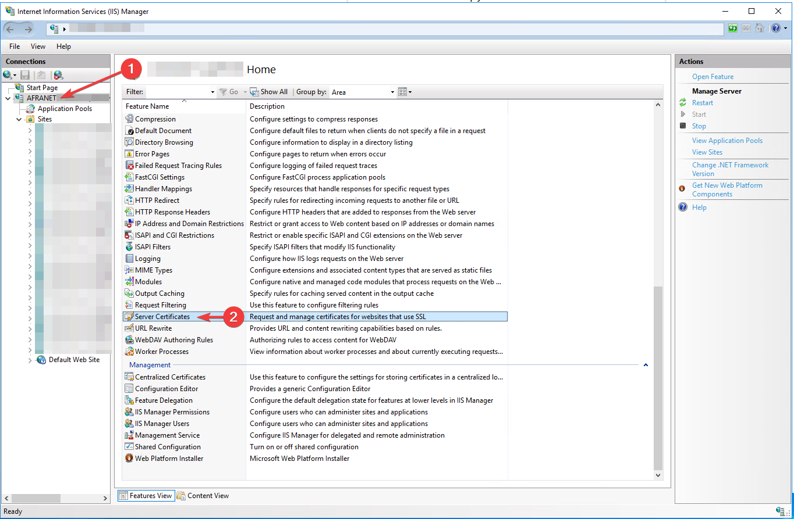

# Installing PEM SSL Certificate on IIS

First we need to Install the [OpenSSL](https://slproweb.com/products/Win32OpenSSL.html) to convert the `pem` files to `pfx`. 

Download and install the `Win64 OpenSSL v3.4.0 Light`*.*

Copy your `pem` files and paste them into the `C:\Program Files\OpenSSL-Win64\bin`

Open the command prompt and, navigate to the installation path `C:\Program Files\OpenSSL-Win64\bin`

Use the following command to convert the `pem` to a `pfx`file.

```powershell
openssl.exe pkcs12 -export -certpbe PBE-SHA1-3DES -keypbe PBE-SHA1-3DES -nomac -out samanqaydi.pfx -inkey private.key.pem -in domain.cert.pem -passout pass:1234
```

## Running on Linux

If you’re using a Linux, OpenSSL is already installed and you don’t have to install it.

navigate to a folder that contains your `pem` files and run the following command.

```bash
openssl pkcs12 -export -certpbe PBE-SHA1-3DES -keypbe PBE-SHA1-3DES -nomac -out samanqaydi.pfx -inkey private.key.pem -in domain.cert.pem -passout pass:1234
```

## Importing the PFX file into the IIS.

1. Open IIS and go to **Server Certificates.**
2. From the right panel, click on **import,** choose the exported `pfx` file and enter the password and select `Web Hosting` for “select Certificate Store”. 
3. Press OK



