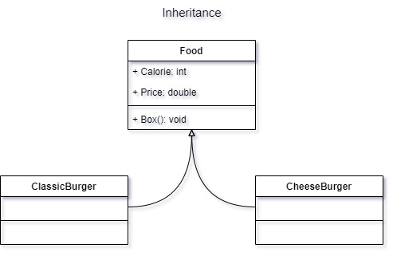
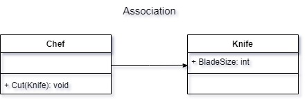
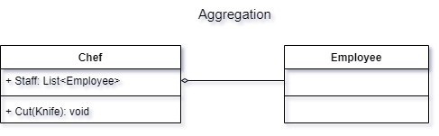
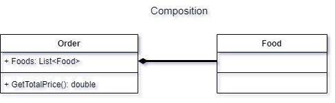

# Objects relationships implementation in C#

## Inheritance
When an object <ins>is</ins> another object.

When an object drives from another object.



Example:
```C#
public class Food
{
    public int Calorie { get; set; }
    public double Price { get; set; }

    public virtual void Box()
    {
        
    }
}


// ChesseBurger IS A Food
public class ChesseBurger : Food 
{
	public ChesseBurger()
	{
		Price = 10;
		Calorie = 110;
	}
}
```
---
## Association
When an object uses another object inside itself but affect second objects life cycle.


Example:
```C#
public class Chef : Employee
    {
        // Association relationshio beetween Chef and knife.
        // Chef object use a Knife object but Chef doesn't affect the knife life cycle.
        public void CutBread(Knife knife)
        {
            Console.WriteLine($"Chef {LastName} is cutting a bread with {knife.BladeSize} cm knife.");
        }
    }
```
---
## Aggregation
When an object has a or several other objects and when we delete the parrent object, other objects can exist.


Example: 
```C#
public class Chef : Employee
    {
        // Aggregation Relationship
        // Chef HAS A OR SEVERAL Team members.
        public List<Employee> Staff { get; set; } = new List<Employee>();
        public void Tech()
        {
            string membersName = string.Join(", ", Staff.Select(t => $"{t.FirstName} {t.LastName} "));

            Console.WriteLine($"Chef {FirstName} {LastName} is teaching to {membersName}");
        }
    }
```
---
## Composition
When an object <ins>has a or several</ins> other objects but those objects cannot exist without their parrent.


Example:
```C#
public class Order
    {
        public IEnumerable<Food> Foods { get; }
        public DateTime DateTime { get; }

        // Composition relationship beetween Order and its food.
        // the foods cannot exist without Order.
        // When we delete the order, the foods that they are inside the order will be destroy.
        public Order(List<Food> foods)
        {
            Foods = foods;
            DateTime = DateTime.Now;
        }

        public double GetTotalPrice()
        {
            return Foods.Select(t => t.Price).Sum();
        }
    }
```
---
# OOP principles implementation in C#